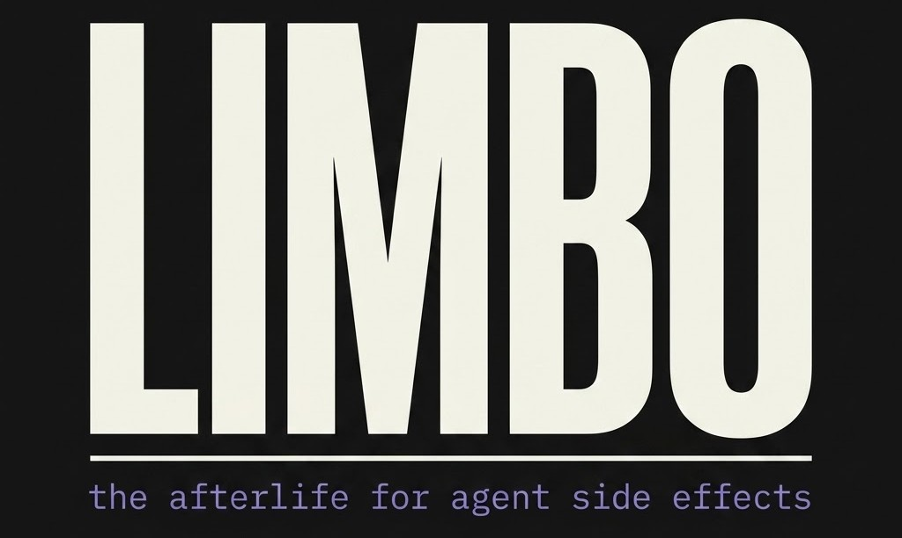
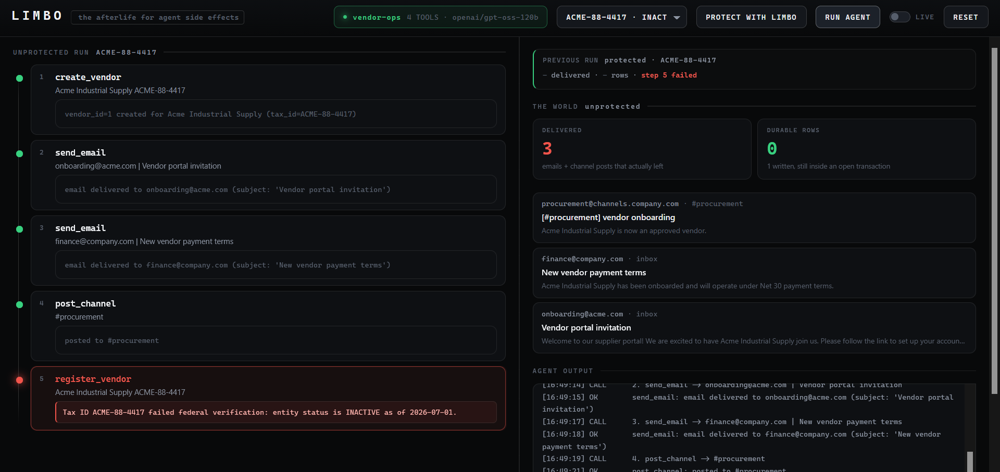
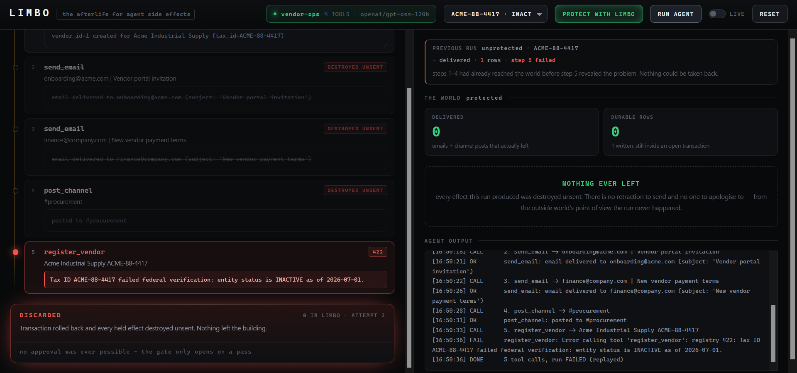
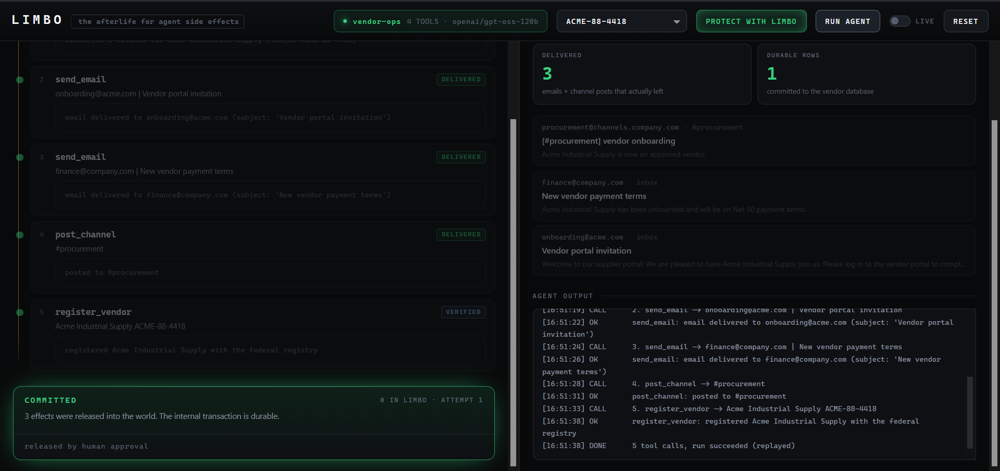

<p align="center">
  
</p>

<p align="center">
  
  
  
  
  
</p>
<p align="center">
  
  
  
  
</p>

### `git commit` for agent actions

Every mature system separates *doing* from *committing*. Agents don't. They
execute irreversible external actions mid-plan, and when step 5 fails, steps
2–4 have already reached the world.

No amount of upfront validation prevents it, because the failure lives in a
third-party system you can only learn about by calling it.

**Limbo stages every outbound effect and runs internal state in a transaction.
Verify, then commit both or neither.** The agent gets a working copy of the
world.

---

## The scenario

Onboard a vendor across the company — five steps, in order:

| # | Tool | Class | Outcome |
|---|---|---|---|
| 1 | `create_vendor` | internal | row written, inside an open SQL transaction |
| 2 | `send_email` → the vendor | **external** | portal invitation |
| 3 | `send_email` → finance | **external** | payment terms |
| 4 | `post_channel` → #procurement | **external** | announcement |
| 5 | `register_vendor` | verify | **fails 422 — tax ID rejected** |

Validating a tax ID *is* submitting it. Every prior step validated correctly
against everything knowable at the time — and by the time the registry says no,
three people have already been told the vendor is approved.

Run it unprotected and those three messages are gone. Run it through Limbo and
they never left the building.

---

## The demo, in three frames

**1 — A plain LangGraph agent, no staging layer.** It works through all five
steps. Step 5 comes back `422 — entity status is INACTIVE`, and by then three
emails have already been delivered and a row written. Nothing here is
recoverable; the failure arrived after the damage.

<p align="center">
  
</p>

**2 — The same agent, same tax ID, connected through Limbo.** Steps 2–4 never
reach the world: they are held, and the agent gets a plausible receipt so it
stays coherent. Step 5 still makes the real call and still gets the real 422 —
and that failing verdict destroys the held effects on its own. **0 delivered,
0 rows.** No human had to intervene to make the world safe.

<p align="center">
  
</p>

**3 — The operator corrects the tax ID and runs again.** Same agent, same
prompt, same code path — only the input changed. The registry accepts
`ACME-88-4418`, the verdict flips to `VERIFIED`, and the gate unlocks. One
human approval releases all three effects at once and makes the row durable.

<p align="center">
  
</p>

---

## What you see

An operator console. Connect an agent, pick a vendor, run it — first
unprotected, then through Limbo — and watch every step land in real time.

```
        UNPROTECTED                       PROTECTED
        tools  :9001                      tools  :9000  (behind Limbo :8080)
        mail   :8035 / :8036              mail   :8025 / :8026
        db     unprotected.db             db     limbo.db
              |                                 |
        agent MCP_URL=:9001               agent MCP_URL=:8080
              |                                 |
              \____ control :8090 ______________/
                          |
                    panel on :8081
```

The two runs are the same frame, run twice. The left column is the **step
ledger** — five effects on a spine, each carrying what the agent did *and* what
Limbo decided about it (`FORWARDED`, `IN LIMBO`, `VERIFYING`, `DESTROYED
UNSENT`). The right column is the world: what actually got delivered, how many
rows are durable, and the previous run's damage kept on screen beside it.

Same agent file. Same model. Same prompt. Same bug. **One environment variable.**

---

## How it works

```
                    ┌─────────────────────────────┐
   agent ──MCP──►   │  MIRROR                     │  identical tool list
                    │  CLASSIFIER                 │  internal | verify | external
                    └──────┬──────────────┬───────┘  unknown → external
                           │              │
                  internal/verify      external
                           │              │
                           ▼              ▼
                    ┌───────────┐  ┌──────────────┐
                    │ FORWARD   │  │  HOLD        │
                    │ (in TXN)  │  │  + plausible │
                    └─────┬─────┘  │    receipt   │
                          │        └──────┬───────┘
                          └───────┬───────┘
                                  ▼
                          ┌───────────────┐
                          │   VERIFIER    │
                          └───┬───────┬───┘
                         PASS │       │ FAIL
                              ▼       ▼
                     ┌──────────┐ ┌──────────────┐
                     │  COMMIT  │ │   DISCARD    │
                     │ SQL      │ │ SQL ROLLBACK │
                     │ COMMIT   │ │ purge limbo  │
                     │ + FLUSH  │ │ nothing sent │
                     └──────────┘ └──────────────┘
```

**Three classes, not two.** `create_vendor` is *internal* — it forwards, but
lands inside a transaction that can be rolled back. `register_vendor` is
*verify* — it forwards too, because verification reads the outside world rather
than changing it, and its real answer is what decides the run. Everything else
is held.

**Invariants:**

| Invariant | Why it matters |
|---|---|
| Unknown tool → external | Fail closed. A tool nobody classified never escapes. |
| Held effects return plausible receipts | The agent stays coherent and never learns it was intercepted. |
| COMMIT unreachable except through a passing verifier | One transition into success. `/commit` returns **409** otherwise. |
| Internal writes wrapped in one SQL transaction | Rollback is a database primitive, not custom undo code. |
| Left and right differ by one env var | It's a layer, not a framework. |

A failing verification **discards on its own** — nobody has to act to make the
world safe. The only path out is a human approving a run that already passed.

---

## Running it

```bash
pip install langgraph langchain-groq langchain-mcp-adapters fastmcp fastapi uvicorn

# Mailpit (standalone binary) goes in bin/, GROQ_API_KEY in .env
scripts/demo.sh up        # starts all eleven processes
scripts/demo.sh ports     # confirms them
```

Open **http://127.0.0.1:8081** and drive it from the panel:

| | Click | What happens |
|---|---|---|
| 1 | **+ CONNECT AGENT** → `vendor-ops` | the agent connects; controls unlock |
| 2 | **RUN AGENT** | unprotected — steps travel 1→5, step 5 hits the 422. **3 delivered, 1 row** |
| 3 | **PROTECT WITH LIMBO** | the staging layer arms; the ledger clears |
| 4 | **RUN AGENT** | steps 2–4 tag `IN LIMBO`, step 5 fails, everything purges. **0 delivered, 0 rows** |
| 5 | vendor → `ACME-88-4418`, **RUN AGENT** | verdict flips to `VERIFIED` |
| 6 | **APPROVE & COMMIT** | the door: 3 effects delivered at once, 1 durable row |

The same arc from a terminal, if you prefer it:

```bash
scripts/demo.sh reset
scripts/demo.sh unprotected   # 3 emails, already gone
scripts/demo.sh protected     # holds 3, hits the 422, purges itself
scripts/demo.sh retry         # attempt 2, corrected tax ID → verdict passes
scripts/demo.sh approve       # the door
```

> Every Mailpit **must** be started with `--api-cors "*"` or the panel's inbox
> panes stay silently empty. `scripts/demo.sh up` handles it.

### Verification, without spending API tokens

```bash
python scripts/check5.py   # both worlds, isolation, discard, gate, commit
```

Drives the same five calls with a direct `fastmcp.Client` — no model, no
tokens. Includes the isolation test proving the two worlds cannot contaminate
each other.

### Replay

A live run records the tool calls the model chose to `runs/<label>.json`;
`--replay` re-issues them with no model in the loop.

```bash
scripts/demo.sh protected replay    # 0 tokens, every effect still real
```

**Replayed:** the model's five tool-call decisions, captured from a real run.
**Live:** every effect — SMTP, SQLite writes, the 422 from the registry,
Limbo's hold / verify / commit / discard, the flush.

From the terminal, live is the default and replay is opt-in. The panel inverts
that — it replays unless you flip **LIVE**, so a rehearsal costs no tokens. A
truncated run is never recorded either way.

---

## Honest limits

- **The verifier is error-based.** Semantic verification — *did the run achieve
  its goal?* — is the obvious next layer.
- **Held effects return synthetic receipts.** Reconciling those against real
  receipts on flush is unsolved, and is the real research problem here.
- **Flush is not atomic.** If the flush itself partially fails you are in the
  state Limbo exists to prevent. It reports the failure rather than hiding it,
  but that is the next thing to build.
- **The proxy sees tool calls, not the agent's plan structure** — that matters
  for dependency ordering on flush. Works with anything, deeper if you
  integrate.
- **The scenario is authored.** The registry rejects that tax ID by design, and
  the prompt names the five steps, so the agent executes an onboarding rather
  than planning one. Every tool call in a run is one the model chose; nothing
  fabricates a step.

## Layout

```
agent/run.py        the agent — Limbo-unaware, reads MCP_URL. Record & replay.
limbo/server.py     the product — mirror, classifier, hold, verify, commit/discard
limbo/control.py    run controller (:8090) — spawns runs, publishes step state
limbo/ui/           the operator console (:8081)
world/tools.py      four real tools with real side effects — Limbo-unaware
world/db.py         SQLite with the transaction held open across a run
world/registry.py   the third-party system that rejects the tax ID
scripts/demo.sh     drives a take end to end
scripts/check5.py   full verification, zero API tokens
runs/               captured transcripts
```
